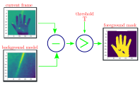

    

---

# Software Used

- `python` - programming language used, tested on `v3.8`
- `miniconda` - for managing virtual environment

# Libraries Used

- `opencv` - [https://github.com/opencv/opencv-python](https://github.com/opencv/opencv-python)
- `imutils` - [https://github.com/PyImageSearch/imutils](https://github.com/PyImageSearch/imutils)
- `pillow` - [https://github.com/python-pillow/Pillow](https://github.com/python-pillow/Pillow)
- `tensorflow` - [https://github.com/tensorflow/tensorflow](https://github.com/tensorflow/tensorflow)
  - `kears` - [https://github.com/keras-team/keras](https://github.com/keras-team/keras)
- `numpy`- [https://github.com/numpy/numpy](https://github.com/numpy/numpy)
- `scikit-learn`- [https://github.com/scikit-learn/scikit-learn](https://github.com/scikit-learn/scikit-learn)

# Modules

- [Image Segmentation](./image_segimentation.ipynb) - just for leaning image segmentation
- [Data Generation](./data_generation.ipynb) - for generating the gestures dataset
- [Data Training](./data_training.ipynb) - for training the CNN model
- [Data Prediction](./data_predict.ipynb) - for predicting the gestures
- [Test GPU](./test_gpu.ipynb) - if you are using GPU use this for test if you have done CUDNN setup properly.

## Image Segmentation

    

- This module is just for learning purpose.
- You can see here how segmentation code works.
- Use this module to play around and understand image segmentation.

## Data Generation

- Contains the code for dataset generation.
- You can add new gestures in this notebook and the generate the data.
- Produce `1000` train data, and `100` test data images.
- This can be done by setting the `no_of_images` and `start_image_num` variables.
- After adding new gesture modify the gestures list for both data training and data generation module.

## Data Training

- Contains the CNN model.
- Modify this model to crete your own new model and train it.
- Use GPU for faster training.
- If you have a Nvidia GPU, follow this [https://www.tensorflow.org/install/gpu](https://www.tensorflow.org/install/gpu) to make tensorflow work with your GPU.

## Data Prediction

- Contains the code for predicting gesture.
- Loads the CNN model and make the prediction.

# License

[MIT](./license)

---